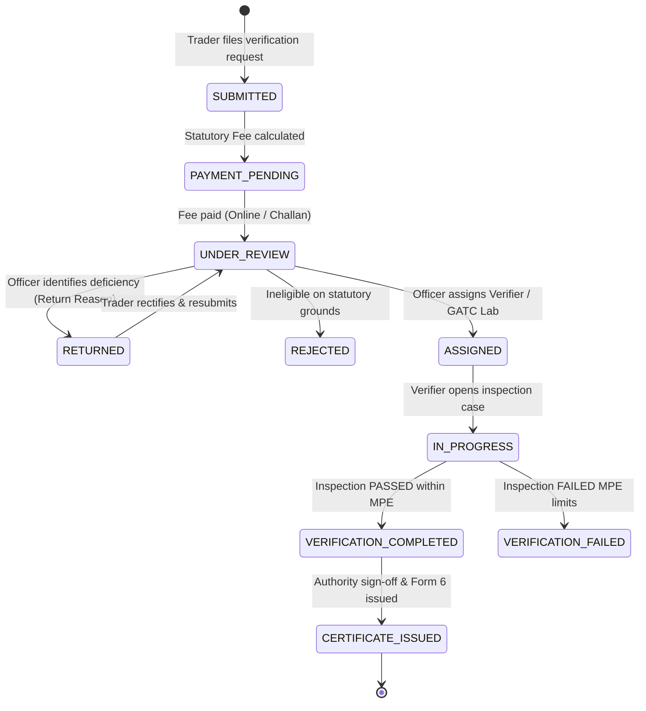

# System Architecture & Technical Design

This document describes the runtime architecture, data flows, statutory state machines, and technical components of the CertifyMetric platform (`SIH26036`).

---

## 1. High-Level Architecture Diagram

```mermaid
graph TD
    %% User Personas
    subgraph Users ["Statutory Roles & Public Users"]
        Trader["Trader / Instrument Owner"]
        Authority["Legal Metrology Officer (Authority)"]
        Verifier["Field Verifier / Inspector"]
        GATC["GATC Testing Laboratory"]
        Admin["Platform Administrator"]
        PublicCitizen["Public Citizen / Consumer (QR Scan)"]
    end

    %% Frontend Layer
    subgraph ClientApp ["Frontend Client (React 19 + Vite SPA)"]
        Router["Route & Role Guard (App.jsx)"]
        Sidebar["Collapsible AppSidebar & TopHeader"]
        LoginView["Login & 1-Click Role Switcher"]
        TraderDash["Trader Dashboard & Registry"]
        ApplyView["Dedicated Multi-Step Apply Verification (5 Steps)"]
        AppModal["Application Details Modal (Particulars & Returns)"]
        AppTimeline["Application Lifecycle Stepper & Specs"]
        AuthDash["Operations Review & Load-Balanced Assignment"]
        VerifierWS["Verification Workspace Wizard (5-Step MPE)"]
        GatcWS["GATC Lab Testing Workspace"]
        CertViewer["Official Form 6 Certificate Viewer"]
        PublicVerify["Public Verification View (/verify/:token)"]
        ApiClient["Centralized API Client (api.js)"]
        QREngine["Client QR Generator (qrcode)"]
    end

    %% Backend Layer
    subgraph ServerApp ["Backend REST API (Node.js + Express)"]
        AuthMiddleware["Session & RBAC Middleware (getActor)"]
        AuthEndpoints["/api/auth (Login, Logout, Me, Seed Switch)"]
        InstrumentAPI["/api/instruments (Registry CRUD)"]
        ApplicationAPI["/api/applications (Apply, Calculate Fee, Review, Assign, Return, Resubmit)"]
        VerificationAPI["/api/verifications (Readings, Checklist, Seals, Evidence)"]
        CertificateAPI["/api/certificates (Generate, Form 6, QR Verification)"]
        PublicVerifyAPI["/api/public/verify/:token (Statutory Unauthenticated Lookup)"]
        AuditAPI["/api/audit-logs & /api/stats"]
        MulterStorage["Multer Disk Storage (/uploads/evidence)"]
    end

    %% Data Storage Layer
    subgraph Persistence ["Data Persistence Layer (MongoDB Atlas / Mongoose)"]
        MongoAtlas[(MongoDB Atlas / Local MongoDB)]
        UsersCol["Users & UserSessions"]
        InstrumentsCol["Instruments & InstrumentCategories & RuleSets"]
        AppsCol["Applications, Assignments, Appointments"]
        VerifsCol["Verifications, VerificationReadings, VerificationEvidence"]
        CertsCol["Certificates"]
        AuditCol["AuditLogs"]
        EvidenceFS["File System: server/uploads/evidence"]
    end

    %% User Interactions to Client
    Trader -->|Authenticates| LoginView
    Authority -->|Authenticates| LoginView
    Verifier -->|Authenticates| LoginView
    GATC -->|Authenticates| LoginView
    Admin -->|Authenticates| LoginView
    PublicCitizen -->|Scans QR (No Auth)| PublicVerify

    LoginView --> Router
    Router --> Sidebar
    Sidebar --> TraderDash
    Sidebar --> ApplyView
    Sidebar --> AuthDash
    Sidebar --> VerifierWS
    Sidebar --> GatcWS
    Sidebar --> CertViewer
    TraderDash --> AppModal
    TraderDash --> AppTimeline

    TraderDash --> ApiClient
    ApplyView --> ApiClient
    AuthDash --> ApiClient
    VerifierWS --> ApiClient
    GatcWS --> ApiClient
    CertViewer --> ApiClient
    CertViewer --> QREngine
    PublicVerify --> ApiClient

    %% Client to Server
    ApiClient -->|HTTP / JSON + Bearer Token| AuthMiddleware
    PublicVerify -->|HTTP GET (Public Token)| PublicVerifyAPI

    AuthMiddleware --> AuthEndpoints
    AuthMiddleware --> InstrumentAPI
    AuthMiddleware --> ApplicationAPI
    AuthMiddleware --> VerificationAPI
    AuthMiddleware --> CertificateAPI
    AuthMiddleware --> AuditAPI

    %% Server to Persistence
    AuthEndpoints --> UsersCol
    InstrumentAPI --> InstrumentsCol
    ApplicationAPI --> AppsCol
    VerificationAPI --> VerifsCol
    VerificationAPI --> MulterStorage
    MulterStorage --> EvidenceFS
    CertificateAPI --> CertsCol
    PublicVerifyAPI --> CertsCol
    PublicVerifyAPI --> InstrumentsCol
    PublicVerifyAPI --> VerifsCol
    ServerApp --> AuditCol
```

---

## 2. Statutory State Machine

The verification application transitions across standardized statutory states:



---

## 3. Core Component Subsystems

### 3.1 Trader Experience & Kerala LMOMS Alignment
* **Instrument Management**: Registration with manufacturer, model, capacity, verification scale interval ($e$), and location.
* **Full-Page Verification Flow (`ApplyVerificationView.jsx`)**:
  1. *Step 1*: Instrument Selection (Existing or New).
  2. *Step 2*: Verification Type & Mode (Original vs Re-verification; In-Situ vs Camp).
  3. *Step 3*: Document & Invoice Upload.
  4. *Step 4*: Schedule V Fee Breakdown calculation.
  5. *Step 5*: Payment authorization & instant tracking.
* **Application Details Modal (`ApplicationDetailsModal.jsx`)**:
  * Rich inspection modal showing complete technical parameters, payment transaction reference, attached documents, and officer deficiency remarks.
  * Direct one-click **"Resubmit Application"** trigger that carries existing application data for rectification without additional fees.

### 3.2 Authority Operations & Load Balancing (`ApplicationReview.jsx`)
* Review of technical eligibility against statutory categories.
* Automated load-balanced allocator with manual authority override.
* Statutory actions:
  * **Approve & Assign**: Moves to active inspection.
  * **Return for Rectification**: Captures mandatory deficiency remarks sent to the trader.
  * **Reject Application**: Closes application with statutory legal grounds.

### 3.3 Verifier Inspection Engine (`VerificationWorkspace.jsx`)
* Multi-point nominal test matrix: $0, \text{Min}, \frac{1}{4}\text{Max}, \frac{1}{2}\text{Max}, \text{Max}$.
* Eccentricity and repeatability testing.
* Automated Maximum Permissible Error (MPE) comparison.
* Photo evidence logging for physical lead/security seals and nameplates.

### 3.4 Official Form 6 Digital Certificate (`OfficialCertificate.jsx` & `PublicVerify.jsx`)
* Conforms to Form 6 statutory format under the Legal Metrology (General) Rules, 2011.
* Includes dynamic cryptographic QR token resolving to `/verify/:token` for instant public validation.

---

## 4. Database Schema (Mongoose Models)

* **`User`**: User credentials, role (`TRADER`, `AUTHORITY`, `VERIFIER`, `GATC`, `ADMIN`), organization reference, jurisdiction.
* **`Instrument`**: Make, model, serial number, category, capacity, scale interval $e$, location, verification status.
* **`Application`**: Application number, instrument ID, trader ID, verification type, mode, status, return reason, fee breakdown, payment particulars, documents.
* **`Assignment`**: Allocation to officer or GATC laboratory, assignment mode, override flags.
* **`Verification`**: Test points, nominal readings, calculated error, MPE pass/fail determination, physical seal numbers, photo evidence.
* **`Certificate`**: Form 6 certificate number, validity period, cryptographic public verification token.
* **`AuditLog`**: Immutable audit logs capturing actor, action, timestamp, IP, and state diffs.
